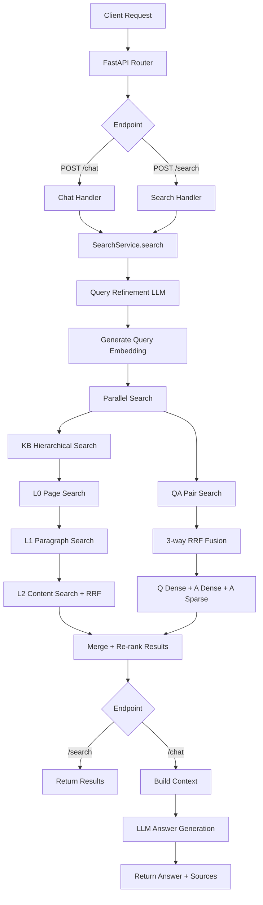
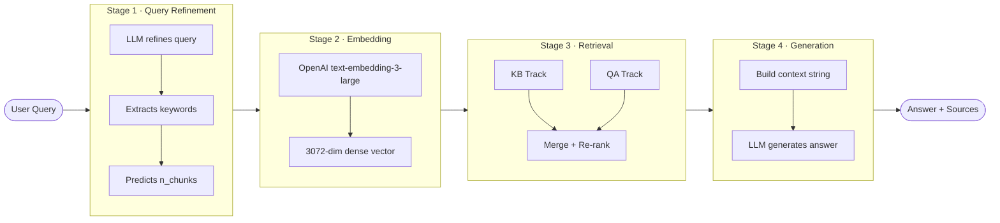
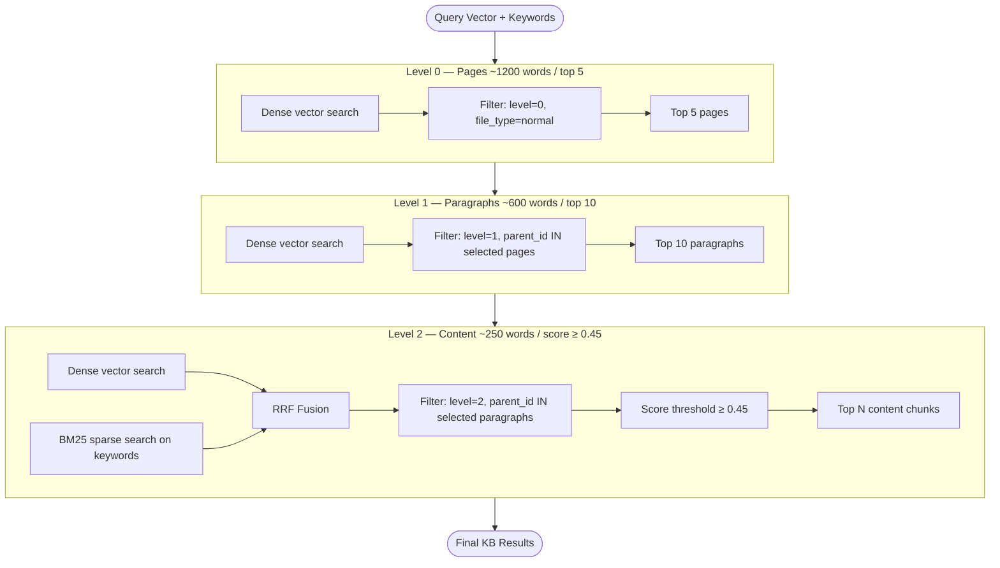
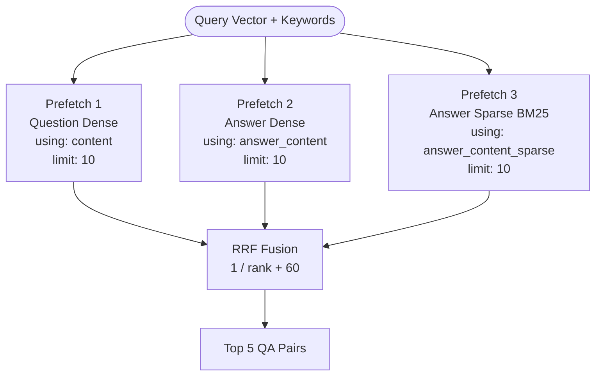
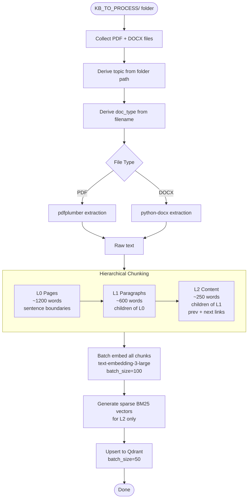
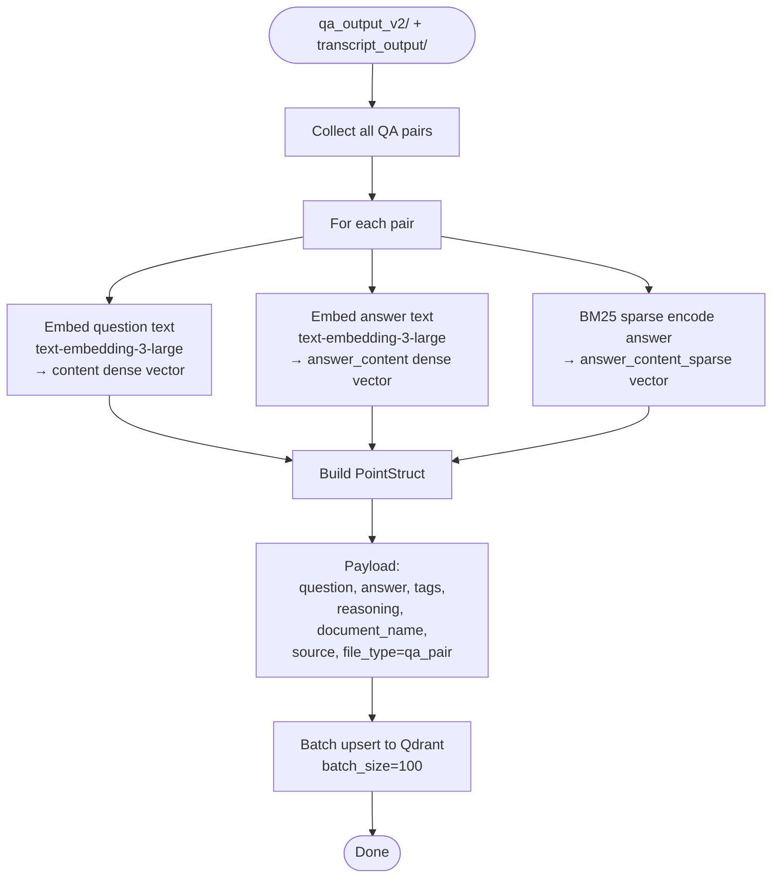
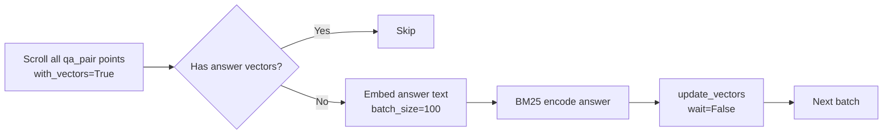
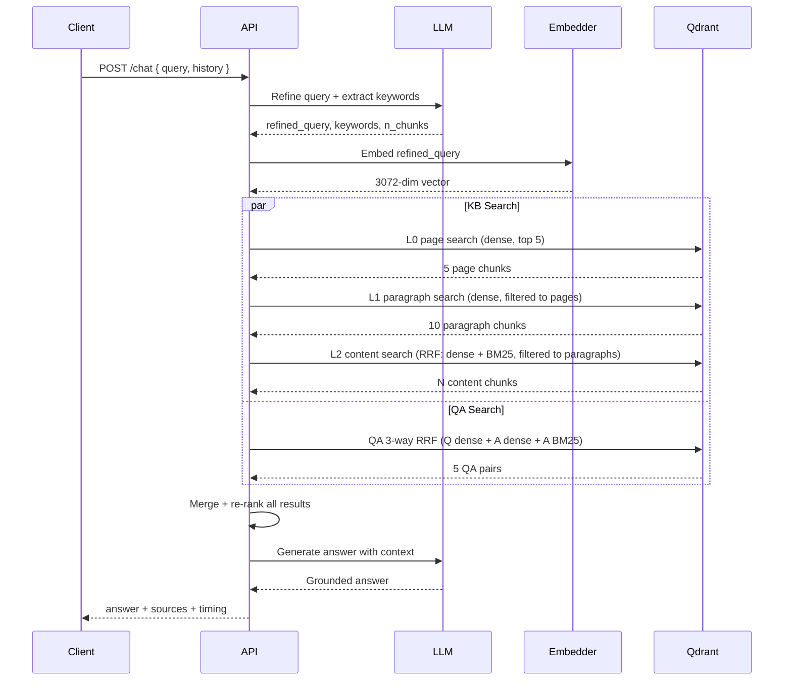

# Nate RAG Pipeline — Technical Documentation

## Table of Contents
1. [System Overview](#system-overview)
2. [Architecture Diagram](#architecture-diagram)
3. [Query Pipeline (Chat/Search)](#query-pipeline)
4. [Retrieval System](#retrieval-system)
5. [Document Ingestion Pipeline](#document-ingestion-pipeline)
6. [QA Ingestion Pipeline](#qa-ingestion-pipeline)
7. [Qdrant Collection Structure](#qdrant-collection-structure)
8. [Answer Generation](#answer-generation)
9. [Configuration Reference](#configuration-reference)

---

## System Overview

The system is a domain-specific RAG (Retrieval-Augmented Generation) assistant for a CPA/realtor specializing in real estate tax strategy. It answers client queries by retrieving from two knowledge sources:

- **Knowledge Base (KB)** — PDFs and DOCX files (guides, scripts, SEO docs, research papers)
- **QA Pairs** — Advisor answers extracted from real client chat conversations and meeting transcripts

```
┌─────────────────────────────────────────────────────────────────┐
│                        Knowledge Sources                        │
│                                                                 │
│   KB Documents                      Client Conversations        │
│   (PDF / DOCX)                      (Chat + Transcripts)        │
│       │                                      │                  │
│       ▼                                      ▼                  │
│  Ingestion Pipeline              QA Extraction Pipeline         │
│       │                                      │                  │
│       └──────────────────┬───────────────────┘                  │
│                          ▼                                      │
│               Qdrant Vector Database                            │
│          (nate-rag-docs collection)                             │
└─────────────────────────────────────────────────────────────────┘
                           │
                           ▼
              ┌────────────────────────┐
              │   FastAPI Application  │
              │  POST /chat            │
              │  POST /search          │
              └────────────────────────┘
```

---

## Architecture Diagram



---

## Query Pipeline

Every query goes through 4 sequential stages before an answer is returned.



### Stage 1 — Query Refinement

The raw user query is sent to the LLM before any search occurs. The LLM returns:

| Output | Description | Example |
|--------|-------------|---------|
| `refined_query` | Semantically expanded version of the query | Adds tax terminology, synonyms |
| `keywords` | 3–10 single-word terms for BM25 matching | `["str", "material", "participation"]` |
| `number_of_chunks` | Predicted how many results are needed (5–20) | `5` for simple, `15` for complex |
| `full_page_content` | Whether to return full page-level content | `true` for broad questions |

### Stage 2 — Embedding

The `refined_query` is embedded using `text-embedding-3-large` (OpenAI), producing a 3072-dimensional dense vector used for both KB and QA searches.

### Stage 3 — Retrieval

Runs as two parallel async tasks:

```
asyncio.gather(
    _search_kb(query_vector, keywords, ...),
    _search_qa(query_vector, keywords, ...)
)
```

Results are merged and re-ranked by score, capped at `n_chunks`.

### Stage 4 — Answer Generation

The merged results are formatted into a structured context string and passed to the LLM with a grounding-strict system prompt. The model answers only from provided context or deflects.

---

## Retrieval System

### KB Track — Hierarchical Drill-Down

The KB search uses a 3-level hierarchy to progressively narrow scope before retrieving small content chunks.



**Why hierarchical?**
- L0 pages act as a coarse topic filter — finds the right document sections
- L1 paragraphs narrow to the right paragraph within that section
- L2 content retrieves the precise sentence-level chunks with hybrid search

Each level is filtered to only children of the level above, so BM25 at L2 only competes within already-relevant parent paragraphs.

### QA Track — 3-Way RRF Fusion

QA pairs are stored with three named vectors. At query time, three separate prefetch passes run and are fused via Reciprocal Rank Fusion:



**Why 3-way fusion?**
- **Question dense** — matches semantically similar questions (original design)
- **Answer dense** — catches cases where query matches the answer content but not the question phrasing
- **Answer sparse (BM25)** — catches keyword-specific matches in answers (tax terms, form numbers, thresholds)

RRF scoring formula: `score = Σ 1 / (rank_i + 60)` — rewards consistently high ranks across all three passes.

### RRF Explained

```
Query: "How many hours for STR material participation?"

Prefetch 1 (Q dense):    Prefetch 2 (A dense):    Prefetch 3 (A sparse):
  Rank 1: QA-A  0.91       Rank 1: QA-C  0.88       Rank 1: QA-A  —
  Rank 2: QA-B  0.87       Rank 2: QA-A  0.85       Rank 2: QA-B  —
  Rank 3: QA-C  0.82       Rank 3: QA-D  0.79       Rank 3: QA-C  —

RRF scores:
  QA-A: 1/61 + 1/62 + 1/61 = 0.0490  ← wins
  QA-B: 1/62 + —   + 1/62 = 0.0323
  QA-C: 1/63 + 1/61 + 1/63 = 0.0479
```

---

## Document Ingestion Pipeline

Runs once per document batch. Takes raw PDFs/DOCXs and stores them in Qdrant as hierarchical chunks.



### Topic Mapping

Folder names in `KB_TO_PROCESS/` are mapped to display topics:

| Folder | Topic Label |
|--------|-------------|
| `0 - firm guidelines` | Firm Guidelines |
| `1 - general strategy` | General Strategy |
| `2 - str loophole` | STR Loophole |
| `3 - cost segregation` | Cost Segs |
| `4 - entity selection` | Entity Selection |
| `5 - s-corps` | S-Corps |
| `6 - bonus depreciation` | Bonus Depreciation |
| `7 - reps` | REPS |
| `8 - 1031 exchanges` | 1031 Exchanges |
| `9 - opportunity zones` | Opportunity Zones |
| `10 - augusta rule` | Augusta Rule |
| `11 - hiring family` | Hiring Family |
| `12 - dsts` | DSTs |

### Doc Type Detection

Filename patterns determine `doc_type`:

| Pattern in filename | doc_type |
|--------------------|----------|
| `SEO -` | `seo` |
| `Script -` | `script` |
| `Outline` | `outline` |
| `Research` | `research` |
| `.pdf` | `pdf` |
| (default) | `guide` |

### Chunk Structure

Each chunk stored in Qdrant has:

```
L0 chunk_id:  {doc_id}_page_{i}
L1 chunk_id:  {doc_id}_paragraph_{parent_id}_{i}
L2 chunk_id:  {doc_id}_content_{parent_id}_{i}

L2 also stores:
  prev_chunk → chunk_id of previous sibling
  next_chunk → chunk_id of next sibling
```

Sibling links allow the context window to include surrounding text when displaying results.

---

## QA Ingestion Pipeline

Takes extracted QA pairs and embeds + stores them in Qdrant with three named vectors.



### Answer Vector Migration

For existing QA points that only had the question vector, a migration script (`scripts/migrate_qa_answer_vectors.py`) was run to add the two answer vectors:



---

## Qdrant Collection Structure

### Collection: `nate-rag-docs`

```
┌──────────────────────────────────────────────────────────────────┐
│                       Qdrant Point                               │
│                                                                  │
│  Vectors (Named):                                                │
│  ┌─────────────────────────────────────────────────────────┐    │
│  │  content              dense  3072-dim  all chunks + QA Q│    │
│  │  content_sparse       sparse BM25      L2 chunks only    │    │
│  │  answer_content       dense  3072-dim  QA pairs only     │    │
│  │  answer_content_sparse sparse BM25     QA pairs only     │    │
│  └─────────────────────────────────────────────────────────┘    │
│                                                                  │
│  Payload:                                                        │
│  ┌─────────────────────────────────────────────────────────┐    │
│  │  file_type      "normal" | "qa_pair"                     │    │
│  │  level          0 | 1 | 2 | null (QA)                    │    │
│  │  text           chunk text / question text               │    │
│  │  answer         answer text (QA only)                    │    │
│  │  document_name  source filename / client name            │    │
│  │  document_id    UUID                                      │    │
│  │  chunk_id       unique identifier                        │    │
│  │  parent_id      parent chunk (L1, L2 only)               │    │
│  │  prev_chunk     previous sibling (L2 only)               │    │
│  │  next_chunk     next sibling (L2 only)                   │    │
│  │  topic          "STR Loophole" | "Cost Segs" | ...       │    │
│  │  doc_type       "guide" | "script" | "seo" | "pdf" | ... │    │
│  │  tags           ["tag1", "tag2"] (QA only)               │    │
│  │  source         "chat" | "transcript" (QA only)          │    │
│  │  page_number    page index within document               │    │
│  └─────────────────────────────────────────────────────────┘    │
└──────────────────────────────────────────────────────────────────┘
```

### Vector Usage by Point Type

| Point Type | `content` | `content_sparse` | `answer_content` | `answer_content_sparse` |
|------------|-----------|-----------------|-----------------|------------------------|
| L0 page chunk | ✅ | ❌ | ❌ | ❌ |
| L1 paragraph chunk | ✅ | ❌ | ❌ | ❌ |
| L2 content chunk | ✅ | ✅ | ❌ | ❌ |
| QA pair | ✅ (question) | ❌ | ✅ (answer) | ✅ (answer) |

### Payload Indexes

| Field | Index Type | Used For |
|-------|-----------|----------|
| `file_type` | Keyword | Separate KB vs QA search |
| `level` | Integer | Hierarchical level filtering |
| `document_id` | Keyword | Parent-child linking |
| `parent_id` | Keyword | Drill-down at L1 and L2 |
| `chunk_id` | Keyword | Sibling chunk retrieval |
| `topic` | Keyword | Topic-based filtering |
| `doc_type` | Keyword | Document type filtering |
| `tags` | Keyword | QA tag filtering |
| `text` | Full-text | Direct text search fallback |
| `page_number` | Integer | Page ordering |

---

## Answer Generation

### Context Format Passed to LLM

```
## Knowledge Base

[1] Copy of STR Loophole Guide.docx | STR Loophole
...prev chunk text...
[actual chunk text — ~150 words]
...next chunk text...

[2] Script - STR.docx | STR Loophole
...

## Past Client Q&A

[Q1]
Q: For a new short-term rental, what average stay is required to qualify for STR treatment?
A: The average stay per guest must be 7 days or less (no rounding down)...

[Q2]
...
```

### Answer Generation Rules

The system prompt enforces these behaviors:

```
IF answer found in context:
    → Answer directly, cite exact numbers from context
    → Match length to complexity
    → Include inline caveats
    → Flag if personal review needed

IF partial answer in context:
    → Answer what is grounded
    → Deflect on the specific unknown part
    → "I don't have enough on [X] — let's connect directly"

IF no answer in context:
    → Full deflection
    → "I don't have enough information on that — let's connect directly to go through it."
    → NEVER infer from training knowledge
```

---

## Configuration Reference

All settings are loaded from environment variables (`.env` file).

### LLM / OpenAI

| Variable | Value | Description |
|----------|-------|-------------|
| `OPENAI_API_KEY` | *(secret)* | OpenRouter API key |
| `OPENAI_BASE_URL` | `https://openrouter.ai/api/v1` | OpenRouter base URL |
| `OPENAI_MODEL` | `openai/gpt-5.1` | Model for chat answers |
| `OPENAI_EMBEDDING_MODEL` | `text-embedding-3-large` | Embedding model |

### Qdrant

| Variable | Value | Description |
|----------|-------|-------------|
| `QDRANT_URL` | `https://61c254fe-...aws.cloud.qdrant.io` | Qdrant Cloud URL |
| `QDRANT_COLLECTION_NAME` | `nate-rag-docs` | Collection name |
| `QDRANT_API_KEY` | *(secret)* | Auth key for cloud |

### Chunking

| Variable | Value | Description |
|----------|-------|-------------|
| `CHUNK_SIZE_PAGE` | `1200` | Words per L0 page chunk |
| `CHUNK_SIZE_PARAGRAPH` | `600` | Words per L1 paragraph chunk |
| `CHUNK_SIZE_CONTENT` | `250` | Words per L2 content chunk |
| `CHUNK_OVERLAP` | `0` | Overlap between chunks |

### Retrieval

| Variable | Value | Description |
|----------|-------|-------------|
| `RETRIEVAL_LIMIT_PAGES` | `5` | Max L0 pages to select |
| `RETRIEVAL_LIMIT_PARAGRAPHS` | `10` | Max L1 paragraphs to select |
| `RETRIEVAL_LIMIT_FINAL` | `5` | Max L2 chunks in final result |
| `RETRIEVAL_PAGE_PREFETCH_LIMIT` | `20` | L0 prefetch pool size |
| `RETRIEVAL_CONTENT_PREFETCH_LIMIT` | `20` | L2 prefetch pool size |
| `RETRIEVAL_MIN_SCORE_FINAL` | `0.45` | Min score threshold for L2 |
| `USE_KEYWORD_SEARCH_LEVEL2` | `true` | Enable BM25 at L2 and QA |

---

## End-to-End Flow Summary


